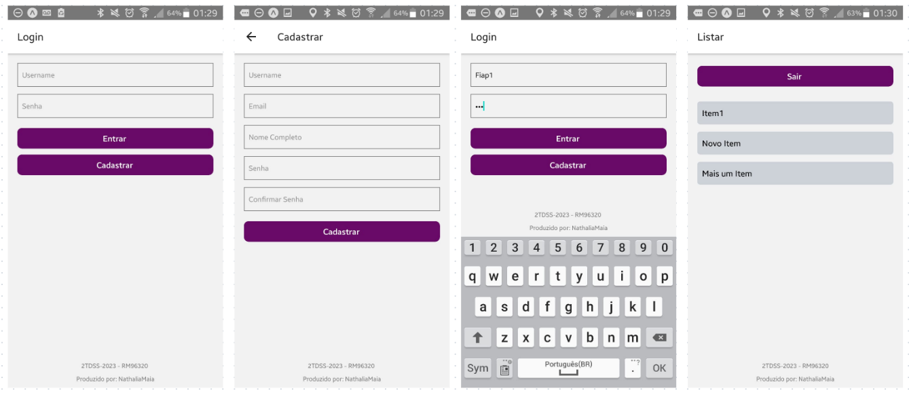
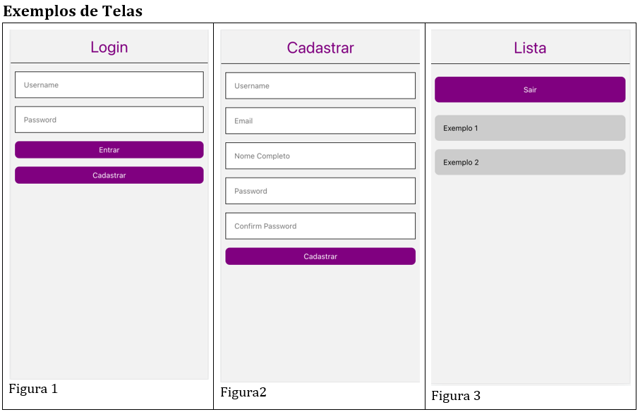

# Projeto Checkpoint

    Este projeto consiste em um aplicativo móvel que possui três telas principais: Login, Cadastro e Lista. O objetivo do aplicativo é permitir que os usuários façam login em suas contas, realizem o cadastro de novas contas e visualizem uma lista de itens.



---
## <span style="color: #grey;">Telas</span>

- [Tela de Login](#tela-de-login)
- [Tela de Cadastro](#tela-de-cadastro)
- [Tela de Lista](#tela-de-lista)

## <span style="color: #grey;">API</span>

- [Requisição de Login](#requisicao-de-login)
- [Requisição de Cadastro](#requisicao-de-cadastron)
- [Requisição da Lista de Itens](#requisicao-da-lista-de-itens)

---

### <span style="color: #D29DA0;">Tela de login</span>

    A tela de login é a primeira tela do aplicativo. Nela, o usuário pode inserir suas credenciais (nome de usuário e senha) para acessar sua conta. Após realizar o login com sucesso, o usuário será redirecionado para a tela de Lista.

### <span style="color: #D29DA0;">Tela de Cadastro</span>

    Na tela de cadastro, o usuário pode preencher um formulário com seus dados pessoais, como nome de usuário, e-mail, nome completo, senha e confirmação de senha. Ao clicar no botão "Cadastrar", os dados serão enviados para uma API que realizará o cadastro do usuário. Se o cadastro for realizado com sucesso (retorno de status 200-OK), o usuário receberá uma mensagem de sucesso e será redirecionado para a tela de login. Caso ocorra algum erro durante o cadastro (retorno de status 400-Bad Request), o usuário receberá uma mensagem de erro e poderá corrigir as informações no próprio formulário.

### <span style="color: #D29DA0;">Tela de Lista</span>

    A tela de lista exibe uma lista de itens, que são carregados através de uma requisição à API. Ao carregar a tela, o aplicativo buscará os dados da lista do usuário na API, utilizando um token de acesso obtido durante o login. Além da lista, a tela também contém um botão "Sair" que, ao ser clicado, redireciona o usuário de volta para a tela de login utilizando o método "replace" do navegador.


# <span style="color: #D1704A;">API</span>

    O aplicativo faz uso de uma API para realizar as operações de login, cadastro e obtenção da lista de itens. Segue abaixo as especificações das requisições utilizadas:

- <span style="color: #4BCC00;">Requisição de Login:</span>


    Endpoint: `http://profkaz-api.keepinvest.com.br/user/sign-in`

    <br/>
    Método: POST

    <br/>

    **Body:**
    ```json
    {
    "username": "USERNAME_DO_USUARIO",
    "password": "SENHA_DO_USUARIO"
    }
    ```
    <br/>

- <span style="color: #4BCC00;">Requisição de Cadastro:</span>

    Endpoint: `http://profkaz-api.keepinvest.com.br/user/sign-in`

    <br/>
    Método: POST

    <br/>

    **Body:**
    ```json
    {
    "username": "testuser",
    "email": "testuser@example.com",
    "nomeCompleto": "Test User",
    "password": "test1234",
    "confirmPassword": "test1234"
    }
    ```
    <br/>

- <span style="color: #4BCC00;">Requisição da Lista de Itens:</span>

    Endpoint: `http://profkaz-api.keepinvest.com.br/user/sign-in`

    <br/>
    Método: POST

    <br/>

    **Body:**
    ```json
    {
    "username": "testuser",
    "email": "testuser@example.com",
    "nomeCompleto": "Test User",
    "password": "test1234",
    "confirmPassword": "test1234"
    }
    ```
    <br/>

**Códigos de Respostas**

| código | descrição |
|-|-
| 200 | OK |
| 404 | Not Found |
<br/>

# <span style="color: #AB3ED7;">Design proposto</span>

O design do aplicativo segue o modelo fornecido pelo professor da matéria. A imagem abaixo ilustra o design proposto:

<br/>



<br/>

# <span style="color: #CD2E5D;">Configuração e Execução</span>


Para executar o aplicativo em um ambiente de desenvolvimento, siga as instruções abaixo:

<br/>


    1. Certifique-se de ter o Node.js e o npm (gerenciador de pacotes do Node.js) instalados em seu sistema.
    2. Clone o repositório do projeto.
    3. No terminal, navegue até o diretório raiz do projeto.
    4. Execute o comando `npm install` para instalar as dependências do projeto.
    5. Execute o comando `npm start` para iniciar o aplicativo.
    6. Use um emulador de dispositivo móvel ou o aplicativo Expo Go em seu dispositivo físico para visualizar o aplicativo em execução.

<br/>

# <span style="color: #AB3ED7;">Considerações Finais</span>


Este projeto foi desenvolvido como parte de um trabalho acadêmico para a Faculdade FIAP. Ele demonstra a implementação de um aplicativo de login, cadastro e lista, utilizando uma API para interação com o servidor. O código-fonte completo do projeto pode ser encontrado no repositório do GitHub: [https://github.com/natmaia/cp_NATHALIAMAIA].


### <span style="color: #AB3ED7;">Nathália Maia</span>
